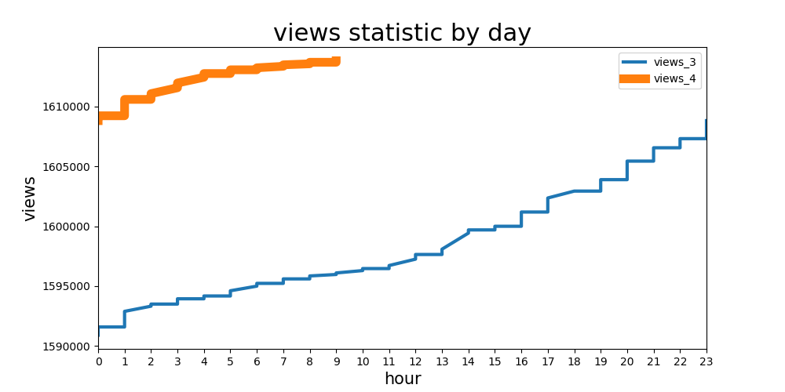
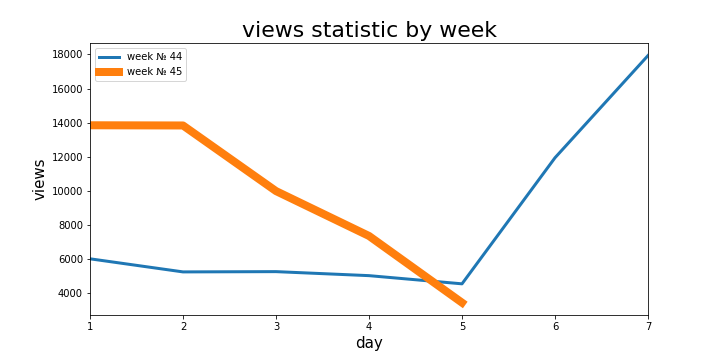
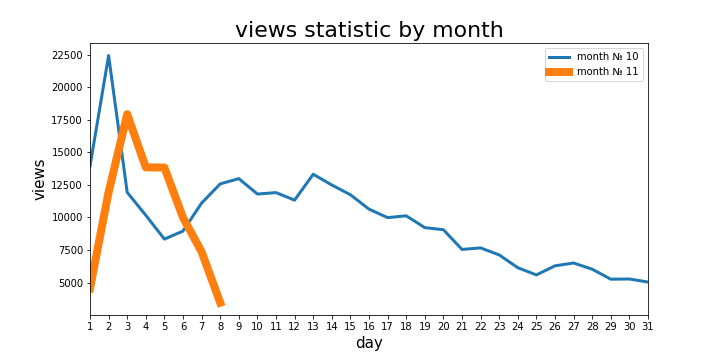

# telegram bot for your youtube channel
1. the bot creates log
2. the bot shows subscribers and view statistic info for selected youtube channel.
3. once every n seconds the bot check the change in the number of subscribers and sends a notification to the designated contacts if the numbers have changed
4. additionally the bot informs about the weather [openweathermap](https://openweathermap.org/)
5. the bot show rest of the Internet traffic (only for my provider)

build on [heroku](https://www.heroku.com/) and use posgressql







don't forget to [create tables](samples/make_main_tables.sql)

and specify your config vars on Heroku

|**variable name**|type|description|
|:---|:---:|:---|
`CHANNEL_NAME`|str|name of the channel and table to store data in database|
`DATABASE_URL`|str|connection string for your database|
`PROJECT_NAME`|str|just name of your project. use to make heroku web hook|
`TELEGRAM_TOKEN`|str|create your bot and get the token [here](https://tlgrm.ru/docs/bots)|
`WEATHER_TOKEN`|str|get you own token [here](https://home.openweathermap.org/users/sign_up)|
`YOUTUBE_TOKEN`|str|your token [more info](https://developers.google.com/youtube/registering_an_application)|
`DELAY`|int|sleep time (seconds)|


for local use, create `config.py` with environ variables

```python
import os

os.environ['CHANNEL_NAME'] = 'name of the channel and database you create'
os.environ['DATABASE_URL'] = 'con. string'
os.environ['PROJECT_NAME'] = 'bot name'
os.environ['TELEGRAM_TOKEN'] = '<your token>'
os.environ['WEATHER_TOKEN'] = '<your token>'
os.environ['YOUTUBE_TOKEN'] = '<your token>'
os.environ['DELAY'] = 900 # sleep time
```

***

# telegram bot для вашего youtube канала: 
1. пишет логи
2. возврашать по запросу количетво просмотров и подписчиков канала на youtube.com
3. раз в n секунд проверять изменение количества подписчиков и отправляет уведомление обозначенным контактам если цифры изменились
4. по запросу возвращать погоду [openweathermap](https://openweathermap.org/)
5. показывает информацию о остатке интернет трафика (актуально только для моего провайдера)

настроен на работу с сервисом [heroku](https://www.heroku.com/)  и базой данных posgressql.


не забудь [создать нужные таблицы](samples/make_main_tables.sql)


и прописать переменные окружения в Heroku


|**variable name**|type|description|
|:---|:---:|:---|
`CHANNEL_NAME`|str|name of the channel and table to store data in database|
`DATABASE_URL`|str|connection string for your database|
`PROJECT_NAME`|str|just name of your project. use to make heroku web hook|
`TELEGRAM_TOKEN`|str|create your bot and get the token [here](https://tlgrm.ru/docs/bots)|
`WEATHER_TOKEN`|str|get you own token [here](https://home.openweathermap.org/users/sign_up)|
`YOUTUBE_TOKEN`|str|your token [more info](https://developers.google.com/youtube/registering_an_application)|
`DELAY`|int|sleep time (seconds)|


для локального испольнения, создай файл `config.py` с переменными окружения

```python
import os

os.environ['CHANNEL_NAME'] = 'name of the channel and database you create'
os.environ['DATABASE_URL'] = 'con. string'
os.environ['PROJECT_NAME'] = 'bot name'
os.environ['TELEGRAM_TOKEN'] = '<your token>'
os.environ['WEATHER_TOKEN'] = '<your token>'
os.environ['YOUTUBE_TOKEN'] = '<your token>'
os.environ['DELAY'] = 900 # sleep time
```