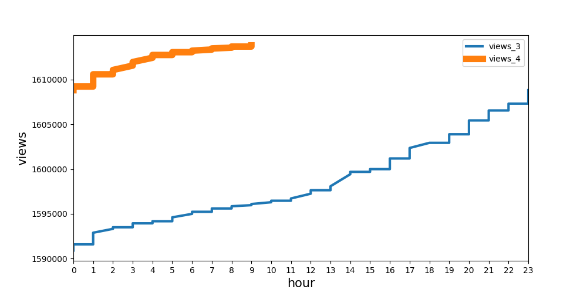
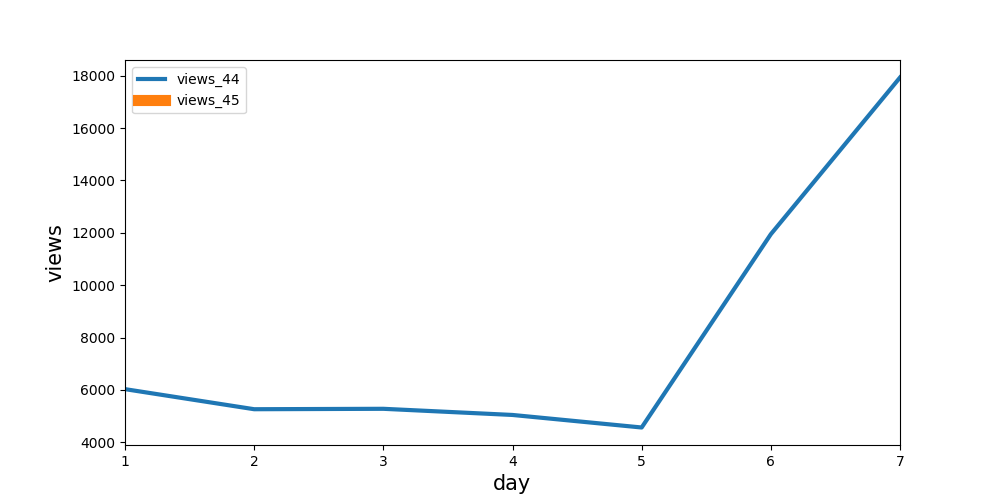
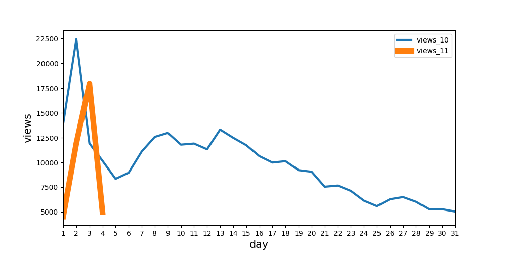

# telegram bot for your youtube channel
1. create log
2. show subscribers and view statistic info.
3. additionally informs about the weather [openweathermap](https://openweathermap.org/)
4. show rest of the Internet traffic (only for my provider)

build on [heroku](https://www.heroku.com/) and use posgressql

# telegram bot для вашего youtube канала: 
1. пишет логи.
1. возврашать по запросу количетво просмотров и подписчиков канала на youtube.com, и в виде граффика динамику просмотров
2. раз в n секунд проверять изменение количества подписчиков и отправляет уведомление обозначенным контактам
3. по запросу возвращать погоду (получаем используюя апи [openweathermap](https://openweathermap.org/))
4. показывает информацию о остатке интернет трафика. (актуально только для моего провайдера)

настроен на работу с сервисом [heroku](https://www.heroku.com/)  и базой данных posgressql.







[don't forget to create tables](./database_sample/make_main_tables.sql)

[не забудь создать нужные таблицы](./database_sample/make_main_tables.sql)

and specify your config vars

и прописать переменные окружения

##### CHANNEL_NAME
##### DATABASE_URL
##### PROJECT_NAME
##### TELEGRAM_TOKEN
##### WEATHER_TOKEN
##### YOUTUBE_TOKEN

для локального испольнения создай файл `config.py` содержащий

```python
import os

os.environ['CHANNEL_NAME'] = 'name of the channel and database you create'
os.environ['DATABASE_URL'] = 'con. string'
os.environ['PROJECT_NAME'] = 'bot name'
os.environ['TELEGRAM_TOKEN'] = '<your token>'
os.environ['WEATHER_TOKEN'] = '<your token>'
os.environ['YOUTUBE_TOKEN'] = '<your token>'
```